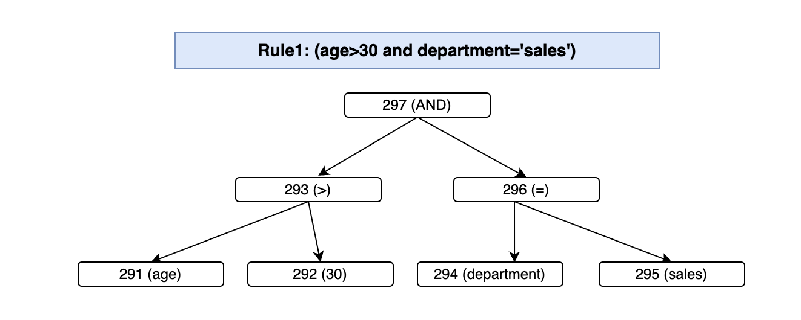
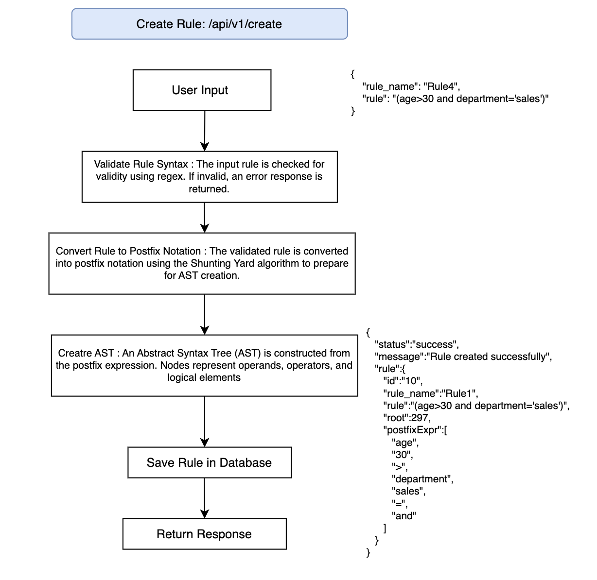
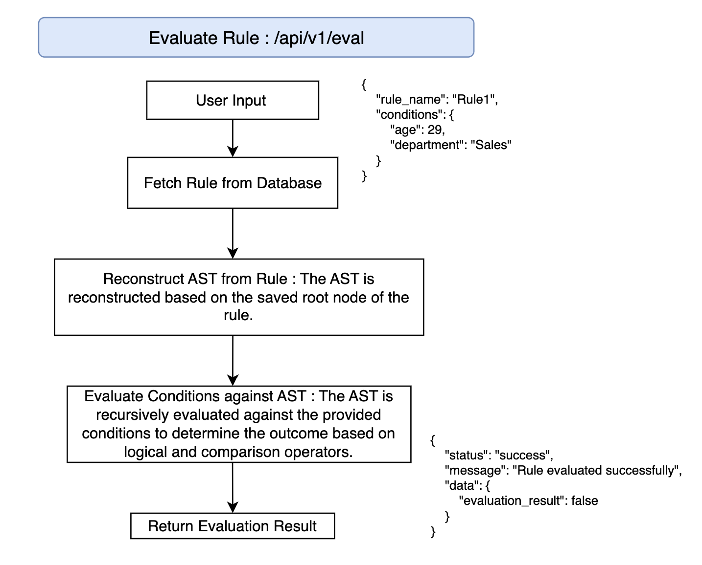

# Rule Engine

## Objective

This is a straightforward 3-tier rule engine system (comprising a simple UI, API, and Backend) that evaluates user eligibility based on criteria such as age, department, income, and spending. The system uses an Abstract Syntax Tree (AST) to model conditional rules, allowing rules to be created, combined, and modified dynamically.

## Data Structure

The AST is represented by a flexible data structure that allows rules to be adjusted easily. A suggested data structure for this purpose is a `Node`, with the following fields:

- **type**: A string specifying the node type (e.g., "operator" for AND/OR, "operand" for conditions)
- **left**: Reference to the left child Node
- **right**: Reference to the right child Node (for operator nodes)
- **value**: Optional value for operand nodes (e.g., a number for comparison)

## Data Storage

Rules and metadata are stored in a database. PostgreSQL is well-suited here due to its powerful SQL compliance, robust relational structure, and support for complex queries and data integrity.

### Example Schema

**Rule Schema**:
```json
{
  "rule_name": "string",
  "rule": "string",
  "postfixExpr": "string",
  "AST": "object"
}
```


## 1. Create Rule(rule_string) 

-This function takes a string representing a rule (as shown in the examples) and returns a Node object representing the corresponding AST. The Shunting Yard algorithm is used to convert the rule string into a postfix expression, which is then used to construct the AST.



### 2. `Combine rules(rules)`
This function takes a list of rule strings and combines them into a single AST. The function concatenates the rules using the AND operator to form a combined rule. The combined rule is then converted into an AST and returned as the root node of the combined AST.

## 3. AST Evaluation Controller

This controller provides functionality to evaluate rules stored in PostgreSQL using an Abstract Syntax Tree (AST). It includes methods to reconstruct the AST from node IDs in PostgreSQL (reconstructAST), evaluate the AST against a set of conditions (evaluateAST), and handle HTTP requests for rule evaluation (evaluateRule). The evaluateRule function retrieves a rule by name, reconstructs its AST, evaluates it based on provided conditions, and returns the evaluation result. The implementation incorporates error handling to ensure appropriate HTTP status codes are returned and errors are logged to the console. Make sure the PostgreSQL models for Node and Rule are defined and properly connected within your application.


## cloning repo

```bash
git clone https://github.com/Nitika2334/Rule_Engine_App.git
```

## Backend Setup

To set up the backend for the rule engine application, follow these steps:

   ```bash
   cd repository/backend
   pip install -r requirements.txt
   python run.py
   ```


## Frontend Setup

To set up the frontend for the rule engine application, follow these steps:

   ```bash
   cd repository/frontend
   npm i
   npm start
   ```
